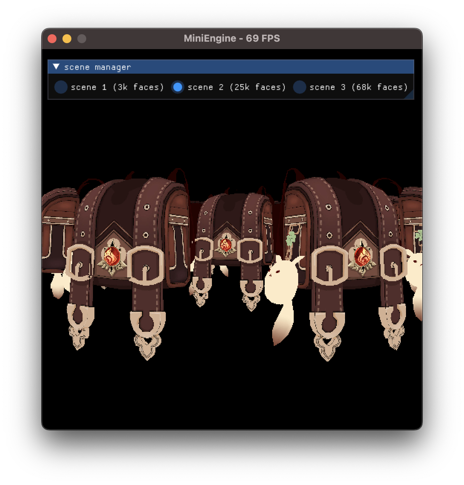

# MiniEngine

**MiniEngine** is my personal render engine playground. 

## Prerequisites

To build the project, you must first install the following tools.

### macOS >= 10.15
- Xcode 12.3 (or more recent)
- CMake 3.21 (or more recent)
- Python 3.6 (or more recent)

### Windows 10/11
- Visual Studio 2019 (or more recent)
- CMake 3.21 (or more recent)
- Python 3.6 (or more recent)

## Build and Run

### macOS

To compile the project, you must have the most recent version of Xcode installed.
Then run 'cmake' from the project's root directory, to generate a project of Xcode.

```shell
cmake -S . -B build -G "Xcode"
```
Now, you can open the Xcode project in `build` folder and play the program with IDE, or only build and run the project with the following commands.
```sh
cmake --build build --config Release
cd bin
./Editor
```

### Windows
You can use the following command to generate the **Visual Studio** project firstly, then open the solution in the `build` directory and build it manually (choose "**Editor**" as the target).
```shell
cmake -S . -B build
```

Or only build and run the project with the following commands.

```sh
cmake --build build --config Release
cd bin
./Editor
```

> **NOTICE**
>
> There is a huge performance difference between using Debug mode and Release mode to compile programs, so be sure to use Release mode for non-debugging purposes.

## Document

### Data Format

MiniEngine can open **.obj** scene models with **.mtl** material files attached (if your model does not contain mtl files or the mesh is not given material properties it will not open), information about the model files is listed below:

- **Geometry**

  We use standard [.obj](https://en.wikipedia.org/wiki/Wavefront_.obj_file) file to store scene geometry data in **triangle mesh**.

  - All geometries are also placed in **right-handed world coordinate system**.
  - You can find example scenes in `engine/editor/demo` folder, or use any DCC software you like to create your geometry scene.

- **Material**

  We use standard **.mtl** file to store phong material parameters. The relationships between specified materials and geometries are described in .obj file using **usemtl**. A Phong model basically has the following parameters:

  - *Kd*: the diffuse reflectance of material, *map_Kd* is the texture file path.
  - *Ks*: the specular reflectance of material.
  - *Tr*: the transmittance of material.
  - *Ns*: shiness, the exponent of phong lobe.
  - *Ni*: the *Index of Refraction(IOR)* of transparent object like glass and water, materials with a value above 1 will be treated as transparent in the tracer.
  - *Ke* : the light emission coefficient of material, materials with a value non-zero will be used as a light source, there must be at least one glowing material object in the scene to illuminate your objects.

### Editor Usage

The engine has an inspector panel where you can set the camera position, orientation and other parameters such as aperture, and determine the required render resolution, number of samples and render output path. 

We also provide an editor interface where you can tour your scene and position the camera. The table below shows the shortcuts available for the editor scene.

|        Shortcut        |              Action               |
| :--------------------: | :-------------------------------: |
|           W            |     Move the camera forward.      |
|           A            |   Move the camera to the left.    |
|           S            |     Move the camera backward.     |
|           D            |   Move the camera to the right.   |
|           Q            |      Move the camera upward.      |
|           E            |     Move the camera downward.     |
|      Mouse Wheel       |     Change FOV of the camera.     |
|        RMB Drag        | Change orientation of the camera. |
| Mouse Wheel + RMB Down | Change move speed of the camera.  |

When you've adjusted everything, click the **Render** button, ray-tracing rendering engine will complete the process of *scene metadata collection*, *BVH construction*, *image rendering*, *noise reduction* and *picture storage* in sequence. If your scene has a large number of facets, building BVH may take quite a bit of time, but it will be worth all the wait, BVH will greatly speed up light intersection during rendering, and we recommend that you turn on the BVH option anyway.

Just make a pot of coffee, and wait for the results! 🥳

## Sample Results

|          Scene          |                 Render Result (Denoise OFF)                  |                  Render Result (Denoise ON)                  |
| :---------------------: | :----------------------------------------------------------: | :----------------------------------------------------------: |
|        Veach-mis        |  |  |
| Cornell-Box with Dragon |  |  |
|        Staircase        |  |  |
|         Avocado         |  |  |
|          Fruit          |  |  |
|          MOSS           |  |  |
