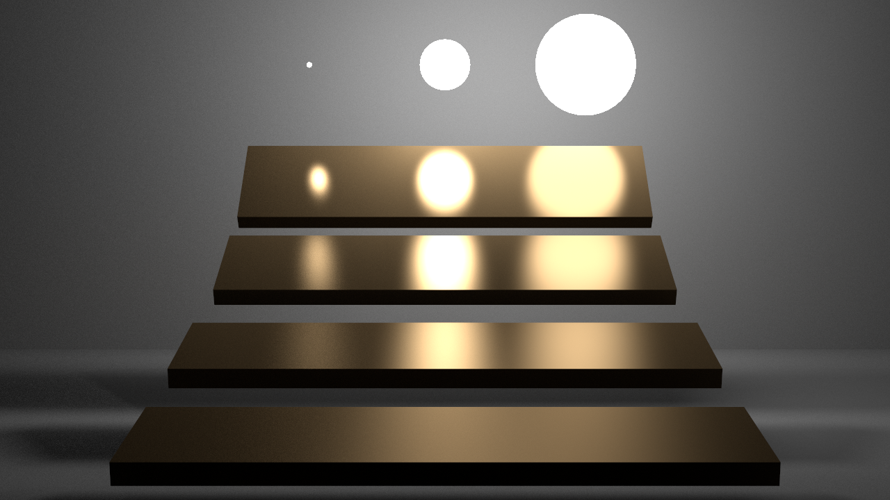
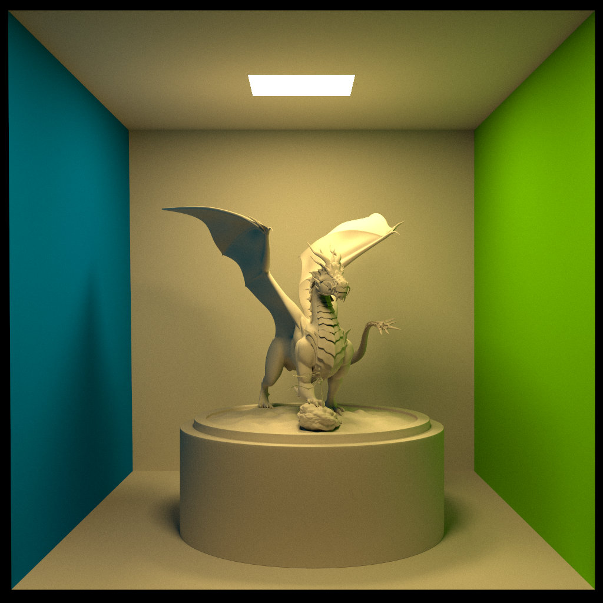
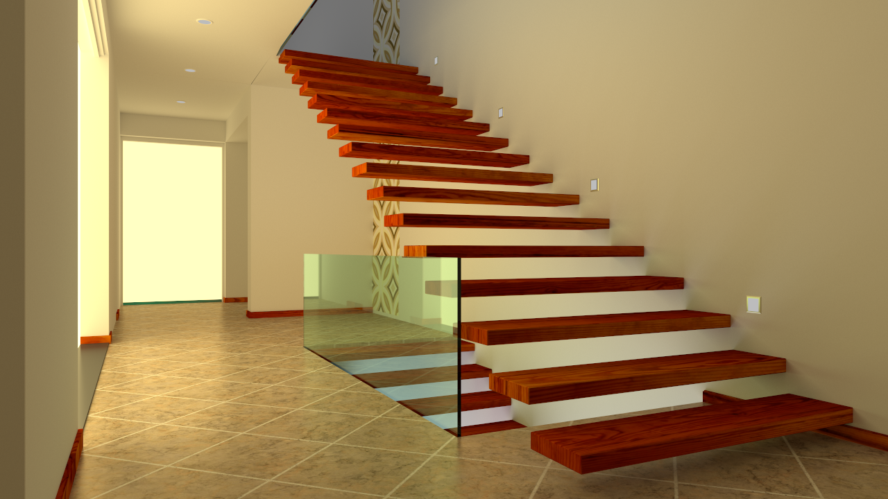

# Computer Graphics 2022 Winter

## Project Requirements
You are required to implement a simple **c++** realistic rendering engine using **Monte Carlo Path Tracing**. 

Some requirements and hints of this course project are listed below:
+ **Camera**: 
  + A standard pinhole perspective camera is placed in **right-handed world coordinate system**. 
  + We store some necessary parameters to uniquely define a perspective camera in **.xml** file:
    - *eye*:  The camera position is in world space. 
    - *lookat*: The target position in world space that the camera points to. 
    - *up*: The up axis of camera in world space. 
    - *fovy*: The field-of-view on the y-axis of camera, the unit is **degree**.
    - *width/height*: The resolution of camera film and result image.
+ **Geometry**: 
  + We use standard [.obj](https://en.wikipedia.org/wiki/Wavefront_.obj_file) file to store scene geometry data in **triangle mesh**. 
  + All geometries are also placed in **right-handed world coordinate system**.
  + You can parse scenes with [**tinyobj**](https://github.com/syoyo/tinyobjloader) for conveniently.
  + View or edit *.mb* scenes using [Maya](https://www.autodesk.com/products/maya/overview) or other tools as you like.
  + For bonus, you can implement other geometry shapes like quad, sphere, box, cylinder and cone. 
+ **Material**: We use standard [.mtl](https://www.fileformat.info/format/material/) file to store **phong** material parameters.The relationships between specified materials and geometries are described in .obj file using **usemtl**. A Phong model basically has the following parameters: 
    - *Kd*: the diffuse reflectance of material, *map_Kd* is the texture file path.
    - *Ks*: the specular reflectance of material.
    - *Tr*: the transmittance of material.
    - *Ns*: shiness, the exponent of phong lobe.
    - *Ni*: the *Index of Refraction(IOR)* of transparent object like glass and water.
+ **Light**: The three scenes are illuminated by different numbers of **area light**. An area light emits energy *uniformly* from geometry surface. We store the **radiance** rgb value of area light in the *.xml* file, the **mtlname** is corresponding to .mtl. 

## Example Rendering Results
### Veach-MIS

### Cornell-Box with Dragon

### Staircase

